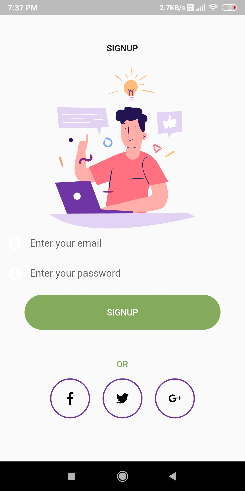
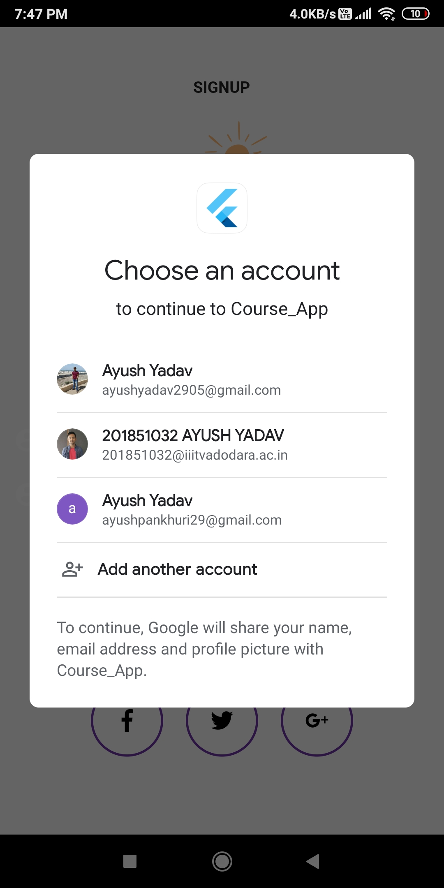

# Course-App-Flutter

* User can Go through the app and see listed courses.
* User need to sign up if he wants to enroll for a course.
* Courses can be online so online meeting link is given to join the course.

# Screenshots

